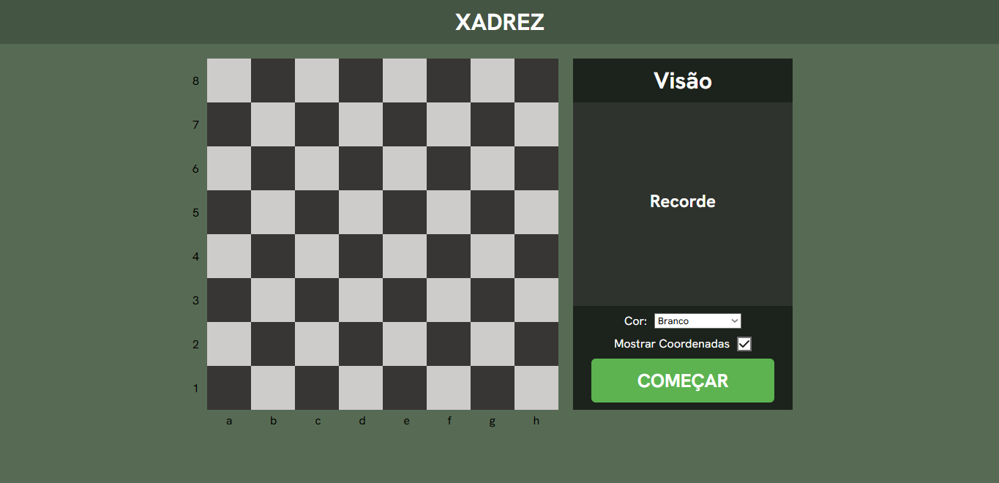

<h1>Treinamento de Visão de Coordenadas no Xadrez</h1>

No xadrez, existem coordenadas no tabuleiro utilizadas para identificar as posições e as jogadas realizadas. Os números de <strong>1</strong> - <strong>8</strong> ficam 
  localizados no lado esquerdo do tabuleiro, enquanto as letras de <strong>a</strong> - <strong>h</strong> ficam na parte inferior.

A partir disso, decidi desenvolver um sistema para treinar a identificação dessas coordenadas. O sistema exibe uma letra e um número aleatórios que, combinados, 
  formam uma coordenada. O usuário deve então selecionar a posição correspondente no tabuleiro. Caso acerte, um ponto é acrescentado à pontuação geral e uma nova
  coordenada é gerada. Caso erre, a pontuação permanece a mesma e uma nova coordenada é gerada.

  

    
  

<h2>Funcionalidades em desenvolvimento</h2>

Existem outras funcionalidades que ainda estão em desenvolvimento, como a opção de selecionar a cor das peças, entre Branco e Preto. Essa escolha fará com que o tabuleiro 
  seja invertido de acordo com a perspectiva escolhida, alterando a ordem dos números e das letras.

Também pretendo desenvolver uma opção para habilitar ou desabilitar a exibição das coordenadas no tabuleiro. 

Outra funcionalidade planejada é a adição de um cronômetro, permitindo que o usuário selecione um determinado tempo para realizar os exercícios.

Além disso, pretendo adicionar ícones mais intuitivos para indicar quando o usuário acertar ou errar uma coordenada e, futuramente, implementar uma forma de armazenar 
  a pontuação obtida.

<h2>Aprendizados</h2>

O principal aprendizado que obtive durante o desenvolvimento deste projeto foi a organização dos arquivos JavaScript por meio de <code>import</code> e <code>export</code>,
  além da separação das funcionalidades entre diferentes arquivos. Isso me ajudou a organizar melhor o código e compreender com mais clareza a responsabilidade de cada arquivo 
  JavaScript.

Além disso, acredito que desenvolvi melhor minha lógica de programação, principalmente na capacidade de dividir o desenvolvimento de um projeto em etapas e pensar na 
  lógica necessária para implementar cada funcionalidade.

<h2>Tecnologias utilizadas</h2>

<ul> 
  <li>JavaScript</li> 
  <li>HTML</li> 
  <li>CSS</li> 
</ul>

<h2>Inspiração</h2>

Este projeto foi desenvolvido com inspiração no <strong>Chess.com</strong>, que possui um exercício para treinar a identificação das coordenadas do tabuleiro de xadrez.

